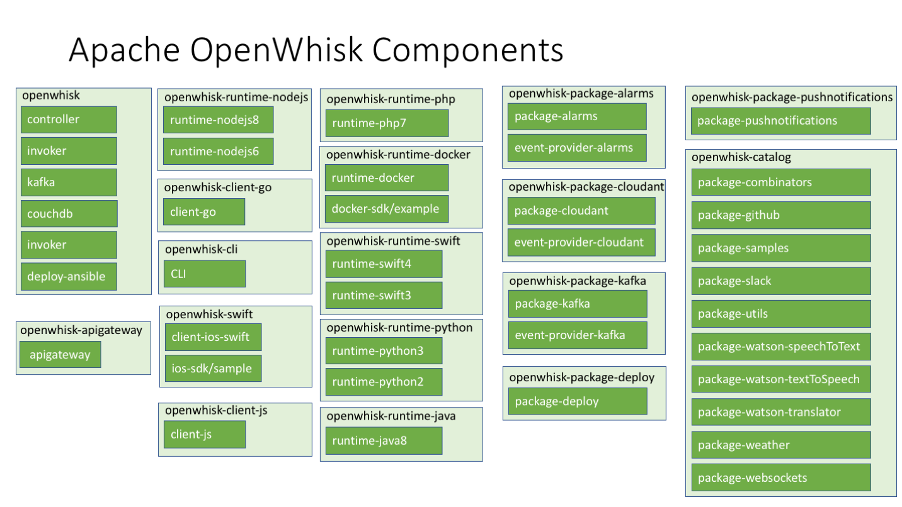

<!--
#
# Licensed to the Apache Software Foundation (ASF) under one or more
# contributor license agreements.  See the NOTICE file distributed with
# this work for additional information regarding copyright ownership.
# The ASF licenses this file to You under the Apache License, Version 2.0
# (the "License"); you may not use this file except in compliance with
# the License.  You may obtain a copy of the License at
#
#     http://www.apache.org/licenses/LICENSE-2.0
#
# Unless required by applicable law or agreed to in writing, software
# distributed under the License is distributed on an "AS IS" BASIS,
# WITHOUT WARRANTIES OR CONDITIONS OF ANY KIND, either express or implied.
# See the License for the specific language governing permissions and
# limitations under the License.
#
-->

# OpenWhisk using an Auction-like approach

This repository contains the source code for the AuctionWhisk prototype used within the papers [**Towards Auction-Based Function Placement in Serverless Fog Platforms**](https://arxiv.org/abs/1912.06096) and [**AuctionWhisk: Using an Auction-Inspired Approach for Function Placement in Serverless Fog Platforms**](https://arxiv.org/abs/2108.13222):

The Function-as-a-Service (FaaS) paradigm has a lot of potential as a computing model for fog environments comprising both cloud and edge nodes, as compute requests can be scheduled across the entire fog continuum in a fine-grained manner. When the request rate exceeds capacity limits at the resource-constrained edge, some functions need to be offloaded towards the cloud.

In this paper, we present an auction-inspired approach in which application developers bid on resources while fog nodes decide locally which functions to execute and which to offload in order to maximize revenue. Unlike many current approaches to function placement in the fog, our approach can work in an online and decentralized manner. We also present our proof-of-concept prototype AuctionWhisk that illustrates how such an approach can be implemented in a real FaaS platform. Through a number of simulation runs and system experiments, we show that revenue for overloaded nodes can be maximized without dropping function requests.

If you use this software in a publication, please cite it as:

### Text

David Bermbach, Setareh Maghsudi, Jonathan Hasenburg, Tobias Pfandzelter. **Towards Auction-Based Function Placement in Serverless Fog Platforms.** In: Proceedings of the Second IEEE International Conference on Fog Computing 2020 (ICFC 2020). IEEE 2020.
David Bermbach, Jonathan Bader, Jonathan Hasenburg, Tobias Pfandzelter, Lauritz Thamsen, **AuctionWhisk: Using an Auction-Inspired Approach for Function Placement in Serverless Fog Platforms**, Software: Practice and Experience, 2021.

### BibTeX
```bibtex
@inproceedings{paper_bermbach_auctions4function_placement,
	title = "Towards Auction-Based Function Placement in Serverless Fog Platforms",
	booktitle = "Proceedings of the Second {IEEE} {International} {Conference} on {Fog} {Computing} (ICFC 2020)",
	author = "Bermbach, David and Maghsudi, Setareh and Hasenburg, Jonathan and Pfandzelter, Tobias",
	year = 2020,
	publisher = "IEEE"
}

@article{bermbach-auctionwhisk-wiley,
    author = "Bermbach, David and Bader, Jonathan, and Hasenburg, Jonathan and Pfandzelter, Tobias and Thamsen, Lauritz",
    title = "AuctionWhisk: Using an Auction-Inspired Approach for Function Placement in Serverless Fog Platforms",
    journal = "Software: Practice and Experience",
    year = 2021,
    publisher = "Wiley"
}
```

For a full list of publications, please see [our website](https://www.mcc.tu-berlin.de/menue/forschung/publikationen/parameter/en/).

### Quick Start
The easiest way to start using OpenWhisk is to get Docker installed on Mac, Windows or Linux. The [Docker website](https://docs.docker.com/install/) has detailed instructions on getting the tools installed. This does not give you a production deployment but gives you enough of the pieces to start writing functions and seeing them run.

```
git clone https://github.com/apache/openwhisk-devtools.git
cd openwhisk-devtools/docker-compose
make quick-start
```

For more detailed instructions or if you encounter problems see the [OpenWhisk-dev tools](https://github.com/apache/openwhisk-devtools/blob/master/docker-compose/README.md) project.

### Kubernetes Setup

Another path to quickly starting to use OpenWhisk is to install it on a Kubernetes cluster.  On a Mac, you can use the Kubernetes support built into Docker 18.06 (or higher). You can also deploy OpenWhisk on Minikube, on a managed Kubernetes cluster provisioned from a public cloud provider, or on a Kubernetes cluster you manage yourself. To get started,

```
git clone https://github.com/apache/openwhisk-deploy-kube.git
```

Then follow the instructions in the [OpenWhisk on Kubernetes README.md](https://github.com/apache/openwhisk-deploy-kube/blob/master/README.md).

### Native development

Docker must be natively installed in order to build and deploy OpenWhisk.
If you plan to make contributions to OpenWhisk, we recommend either a Mac or Ubuntu environment.

* [Setup Mac for OpenWhisk](tools/macos/README.md)
* [Setup Ubuntu for OpenWhisk](tools/ubuntu-setup/README.md)

### Learn concepts and commands

Browse the [documentation](docs/) to learn more. Here are some topics you may be
interested in:

- [System overview](docs/about.md)
- [Getting Started](docs/README.md)
- [Create and invoke actions](docs/actions.md)
- [Create triggers and rules](docs/triggers_rules.md)
- [Use and create packages](docs/packages.md)
- [Browse and use the catalog](docs/catalog.md)
- [OpenWhisk system details](docs/reference.md)
- [Implementing feeds](docs/feeds.md)
- [Developing a runtime for a new language](docs/actions-actionloop.md)

### Repository Structure

The OpenWhisk system is built from a [number of components](docs/dev/modules.md).  The picture below groups the components by their GitHub repos. Please open issues for a component against the appropriate repo (if in doubt just open against the main openwhisk repo).



### Issues

Report bugs, ask questions and request features [here on GitHub](../../issues).

### Slack

You can also join the OpenWhisk Team on Slack [https://openwhisk-team.slack.com](https://openwhisk-team.slack.com) and chat with developers. To get access to our public slack team, request an invite [https://openwhisk.apache.org/slack.html](https://openwhisk.apache.org/slack.html).
